# Pipeline de matching — Cuisinotron3000

> Documentation générée le 2026-06-22. Couvre les fichiers JS tels qu'ils existent sur la branche `claude/claude-md-docs-d1c870`.

---

## Table des matières

1. [Vue d'ensemble des entry points](#1-vue-densemble)
2. [Tronc commun — Parsing & Stripping](#2-tronc-commun--parsing--stripping)
3. [Entry point — Scannage ticket de caisse](#3-entry-point--scannage-ticket-de-caisse)
4. [Entry point — Import de recette](#4-entry-point--import-de-recette)
5. [Matching CIQUAL (nutrition)](#5-matching-ciqual)
6. [Matching Colruyt (liste de courses)](#6-matching-colruyt)
7. [Faisabilité des recettes](#7-faisabilité-des-recettes)
8. [Liste de courses complète](#8-liste-de-courses-complète)
9. [Structures de données persistées](#9-structures-de-données)

---

## 1. Vue d'ensemble

Toutes les routes aboutissent à un `normKey` — une chaîne normalisée (`a-z0-9 ` uniquement, sans accents ni ponctuation) qui sert de clé pivot dans l'app.

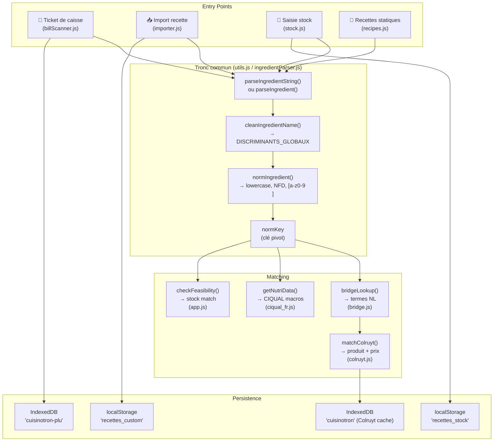
```mermaid
flowchart TD
    subgraph ENTRY["Entry Points"]
        E1["📸 Ticket de caisse\n(billScanner.js)"]
        E2["📥 Import recette\n(importer.js)"]
        E3["📝 Saisie stock\n(stock.js)"]
        E4["📖 Recettes statiques\n(recipes.js)"]
    end

    subgraph CORE["Tronc commun (utils.js / ingredientParser.js)"]
        P1["parseIngredientString()\nou parseIngredient()"]
        P2["cleanIngredientName()\n→ DISCRIMINANTS_GLOBAUX"]
        P3["normIngredient()\n→ lowercase, NFD, [a-z0-9 ]"]
        NK["normKey\n(clé pivot)"]
    end

    subgraph MATCH["Matching"]
        M1["bridgeLookup()\n→ termes NL\n(bridge.js)"]
        M2["matchColruyt()\n→ produit + prix\n(colruyt.js)"]
        M3["getNutriData()\n→ CIQUAL macros\n(ciqual_fr.js)"]
        M4["checkFeasibility()\n→ stock match\n(app.js)"]
    end

    subgraph STORE["Persistence"]
        S1["localStorage\n'recettes_stock'"]
        S2["localStorage\n'recettes_custom'"]
        S3["IndexedDB\n'cuisinotron-plu'"]
        S4["IndexedDB\n'cuisinotron' (Colruyt cache)"]
    end

    E1 --> P1
    E2 --> P1
    E3 --> P1
    E4 --> P1
    P1 --> P2
    P2 --> P3
    P3 --> NK
    NK --> M1
    M1 --> M2
    NK --> M3
    NK --> M4
    M2 --> S4
    E1 --> S3
    E2 --> S2
    E3 --> S1
```

---

## 2. Tronc commun — Parsing & Stripping

Toute chaîne brute d'ingrédient passe par deux fonctions successives avant d'être normalisée.

### 2a. `parseIngredientString()` — extraction qty / unit / rawName

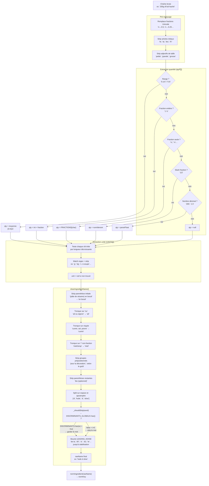
```mermaid
flowchart TD
    RAW["Chaîne brute\nex: '200g d\\'ail haché'"]

    subgraph CLEAN_PRE["Pré-nettoyage"]
        C1["Remplace fractions Unicode\n½→0.5, ¼→0.25…"]
        C2["Strip articles initiaux\n'le', 'la', 'les', 'l\\''"]
        C3["Strip adjectifs de taille\n'petite', 'grande', 'grosse'"]
    end

    subgraph QTY_PARSE["Extraction quantité (qtyP[])"]
        Q1{"Range ?\n'5 à 6' / '5-6'"}
        Q2{"Fraction entière ?\n'1 ½'"}
        Q3{"Fraction seule ?\n'½', '⅓'…"}
        Q4{"Slash fraction ?\n'1/2'"}
        Q5{"Nombre décimal ?\n'200', '1.5'"}
        Q6["qty = null"]
    end

    subgraph UNIT_PARSE["Extraction unité (UNITS{})"]
        U1["Teste chaque clé triée\npar longueur décroissante"]
        U2["Match regex + strip\nex: 'g', 'kg', 'c. à soupe'…"]
        U3["unit = null si non trouvé"]
    end

    subgraph NAME_CLEAN["cleanIngredientName()"]
        N1["Strip parenthèse initiale\n'(pâte de sésame) en bocal'\n→ 'en bocal'"]
        N2["Tronque sur 'ou'\n'ail ou oignon' → 'ail'"]
        N3["Tronque sur virgule\n'cumin, sel, poivre' → 'cumin'"]
        N4["Tronque sur '/' non-fraction\n'miel/sirop' → 'miel'"]
        N5["Strip groupes prépositionnels\n'pour la décoration', 'selon le goût'"]
        N6["Strip parenthèses restantes\n'bio (optionnel)'"]
        N7["Split sur espace et apostrophe\n['d', 'huile', 'd', 'olive']"]
        N8["_shouldStrip(word)\n→ DISCRIMINANTS_GLOBAUX.has() ?"]
        N9["Boucle LEADING_NOISE\n'de la', 'd\\'', 'd ', 'du', 'le'…\njusqu'à stabilisation"]
        N10["rawName final\nex: 'huile d olive'"]
    end

    NORM["normIngredient(rawName)\n→ normKey"]

    RAW --> C1 --> C2 --> C3
    C3 --> Q1
    Q1 -->|oui| Q1R["qty = moyenne\n(5+6)/2"]
    Q1 -->|non| Q2
    Q2 -->|oui| Q2R["qty = int + fraction"]
    Q2 -->|non| Q3
    Q3 -->|oui| Q3R["qty = FRACTIONS[char]"]
    Q3 -->|non| Q4
    Q4 -->|oui| Q4R["qty = num/denom"]
    Q4 -->|non| Q5
    Q5 -->|oui| Q5R["qty = parseFloat"]
    Q5 -->|non| Q6

    Q1R & Q2R & Q3R & Q4R & Q5R & Q6 --> U1
    U1 --> U2 --> U3
    U3 --> N1 --> N2 --> N3 --> N4 --> N5 --> N6 --> N7
    N7 --> N8
    N8 -->|"DISCRIMINANTS.has(w) = true\n→ garder le mot"| N9
    N8 -->|"false + i>0\n→ strip le mot"| N9
    N9 --> N10 --> NORM
```

### 2b. `normIngredient()` — normalisation finale

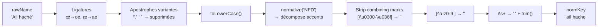
```mermaid
flowchart LR
    IN["rawName\n'Ail haché'"]
    LIG["Ligatures\nœ→oe, æ→ae"]
    APO["Apostrophes variantes\n‘’‚‛ ' ` → supprimées"]
    LOW["toLowerCase()"]
    NFD["normalize('NFD')\n→ décompose accents"]
    ACC["Strip combining marks\n[\\u0300-\\u036f] → ''"]
    ALNUM["[^a-z0-9 ] → ''"]
    WS["\\s+ → ' ' + trim()"]
    OUT["normKey\n'ail hache'"]

    IN --> LIG --> APO --> LOW --> NFD --> ACC --> ALNUM --> WS --> OUT
```

### 2c. `_shouldStrip()` — filtre DISCRIMINANTS

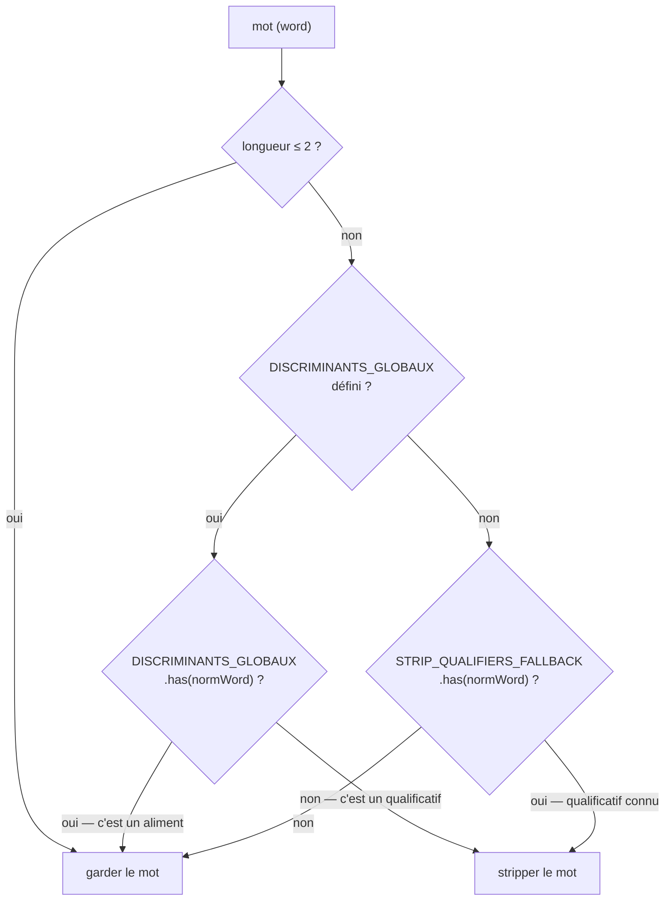
```mermaid
flowchart TD
    W["mot (word)"]
    LEN{"longueur ≤ 2 ?"}
    HAS_DG{"DISCRIMINANTS_GLOBAUX\ndéfini ?"}
    IN_DG{"DISCRIMINANTS_GLOBAUX\n.has(normWord) ?"}
    IN_FB{"STRIP_QUALIFIERS_FALLBACK\n.has(normWord) ?"}
    KEEP["garder le mot"]
    STRIP["stripper le mot"]

    W --> LEN
    LEN -->|oui| KEEP
    LEN -->|non| HAS_DG
    HAS_DG -->|oui| IN_DG
    HAS_DG -->|non| IN_FB
    IN_DG -->|oui — c'est un aliment| KEEP
    IN_DG -->|non — c'est un qualificatif| STRIP
    IN_FB -->|oui — qualificatif connu| STRIP
    IN_FB -->|non| KEEP
```

> **DISCRIMINANTS_GLOBAUX** (2092 entrées, `data/ciqual_discriminants.js`) : liste blanche des mots qui apparaissent dans les noms d'aliments CIQUAL. Garantit que "ail", "tomate", "amande" sont conservés, tandis que "haché", "cru", "surgelé" sont strippés.

---

## 3. Entry point — Scannage ticket de caisse

**Fichier :** `js/billScanner.js`  
**Déclencheur :** `handleBillImage(file)` — photo d'un ticket Colruyt

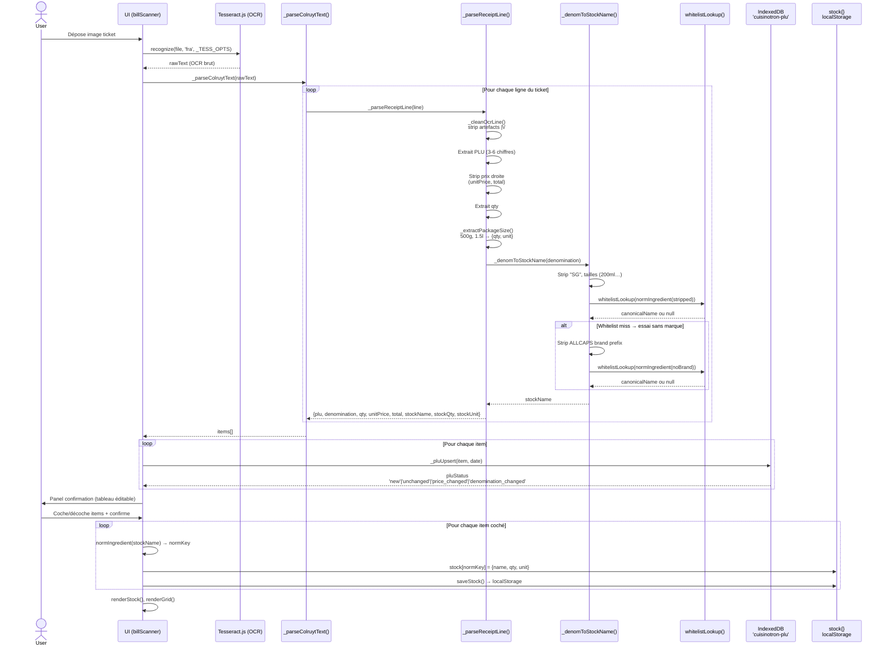
```mermaid
sequenceDiagram
    actor User
    participant UI as UI (billScanner)
    participant TESS as Tesseract.js (OCR)
    participant PARSE as _parseColruytText()
    participant LINE as _parseReceiptLine()
    participant DENOM as _denomToStockName()
    participant WL as whitelistLookup()
    participant PLU as IndexedDB<br/>'cuisinotron-plu'
    participant STOCK as stock{}<br/>localStorage

    User->>UI: Dépose image ticket
    UI->>TESS: recognize(file, 'fra', _TESS_OPTS)
    TESS-->>UI: rawText (OCR brut)

    UI->>PARSE: _parseColruytText(rawText)
    loop Pour chaque ligne du ticket
        PARSE->>LINE: _parseReceiptLine(line)
        LINE->>LINE: _cleanOcrLine()<br/>strip artefacts |\/
        LINE->>LINE: Extrait PLU (3-6 chiffres)
        LINE->>LINE: Strip prix droite<br/>(unitPrice, total)
        LINE->>LINE: Extrait qty
        LINE->>LINE: _extractPackageSize()<br/>500g, 1.5l → {qty, unit}
        LINE->>DENOM: _denomToStockName(denomination)
        DENOM->>DENOM: Strip "SG", tailles (200ml…)
        DENOM->>WL: whitelistLookup(normIngredient(stripped))
        WL-->>DENOM: canonicalName ou null
        alt Whitelist miss → essai sans marque
            DENOM->>DENOM: Strip ALLCAPS brand prefix
            DENOM->>WL: whitelistLookup(normIngredient(noBrand))
            WL-->>DENOM: canonicalName ou null
        end
        DENOM-->>LINE: stockName
        LINE-->>PARSE: {plu, denomination, qty, unitPrice, total, stockName, stockQty, stockUnit}
    end

    PARSE-->>UI: items[]

    loop Pour chaque item
        UI->>PLU: _pluUpsert(item, date)
        PLU-->>UI: pluStatus<br/>'new'|'unchanged'|'price_changed'|'denomination_changed'
    end

    UI->>User: Panel confirmation (tableau éditable)
    User->>UI: Coche/décoche items + confirme

    loop Pour chaque item coché
        UI->>UI: normIngredient(stockName) → normKey
        UI->>STOCK: stock[normKey] = {name, qty, unit}
        UI->>STOCK: saveStock() → localStorage
    end
    UI->>UI: renderStock(), renderGrid()
```

### Structure PLU (IndexedDB `cuisinotron-plu`)

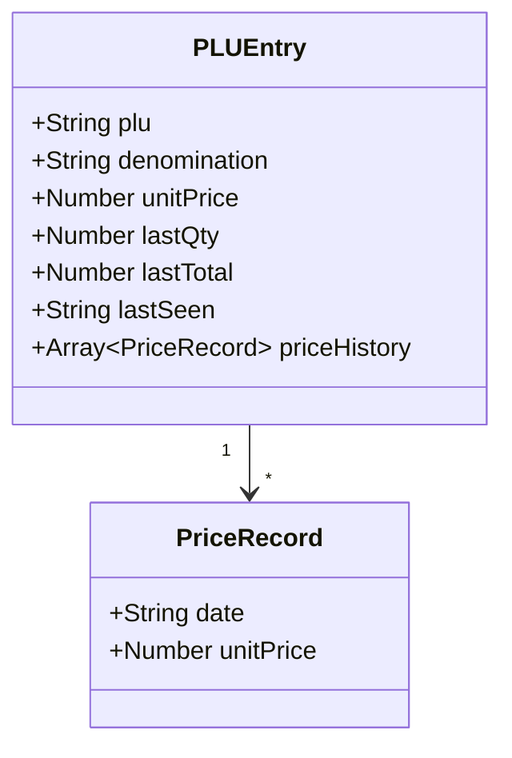
```mermaid
classDiagram
    class PLUEntry {
        +String plu
        +String denomination
        +Number unitPrice
        +Number lastQty
        +Number lastTotal
        +String lastSeen
        +Array~PriceRecord~ priceHistory
    }
    class PriceRecord {
        +String date
        +Number unitPrice
    }
    PLUEntry "1" --> "*" PriceRecord
```

---

## 4. Entry point — Import de recette

**Fichier :** `js/importer.js`  
**Déclencheurs :** bookmarklet (`#import=…`) ou paste JSON-LD manuel

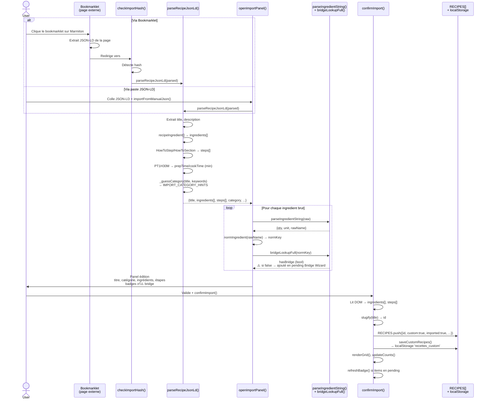
```mermaid
sequenceDiagram
    actor User
    participant BK as Bookmarklet<br/>(page externe)
    participant HASH as checkImportHash()
    participant PARSE as parseRecipeJsonLd()
    participant PANEL as openImportPanel()
    participant INGP as parseIngredientString()<br/>+ bridgeLookupFull()
    participant CONFIRM as confirmImport()
    participant RECIPES as RECIPES[]<br/>+ localStorage

    alt Via Bookmarklet
        User->>BK: Clique le bookmarklet sur Marmiton
        BK->>BK: Extrait JSON-LD de la page
        BK->>HASH: Redirige vers #import=<JSON encodé>
        HASH->>HASH: Détecte hash #import=
        HASH->>PARSE: parseRecipeJsonLd(parsed)
    else Via paste JSON-LD
        User->>PANEL: Colle JSON-LD + importFromManualJson()
        PANEL->>PARSE: parseRecipeJsonLd(parsed)
    end

    PARSE->>PARSE: Extrait title, description
    PARSE->>PARSE: recipeIngredient[] → ingredients[]
    PARSE->>PARSE: HowToStep/HowToSection → steps[]
    PARSE->>PARSE: PT1H30M → prepTime/cookTime (min)
    PARSE->>PARSE: _guessCategory(title, keywords)<br/>→ IMPORT_CATEGORY_HINTS
    PARSE-->>PANEL: {title, ingredients[], steps[], category, ...}

    loop Pour chaque ingredient brut
        PANEL->>INGP: parseIngredientString(raw)
        INGP-->>PANEL: {qty, unit, rawName}
        PANEL->>PANEL: normIngredient(rawName) → normKey
        PANEL->>INGP: bridgeLookupFull(normKey)
        INGP-->>PANEL: hasBridge (bool)<br/>⚠️ si false → ajouté en pending Bridge Wizard
    end

    PANEL->>User: Panel édition<br/>titre, catégorie, ingrédients, étapes<br/>badges ✅/⚠️ bridge

    User->>CONFIRM: Valide + confirmImport()
    CONFIRM->>CONFIRM: Lit DOM → ingredients[], steps[]
    CONFIRM->>CONFIRM: slugify(title) → id
    CONFIRM->>RECIPES: RECIPES.push({id, custom:true, imported:true, ...})
    CONFIRM->>RECIPES: saveCustomRecipes()<br/>→ localStorage 'recettes_custom'
    CONFIRM->>CONFIRM: renderGrid(), updateCounts()
    CONFIRM->>CONFIRM: refreshBadge() si items en pending
```

### Flux JSON-LD → objet recette

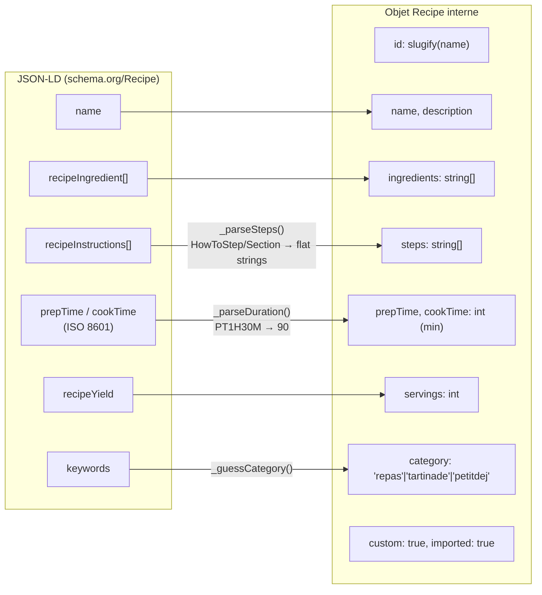
```mermaid
flowchart LR
    subgraph INPUT["JSON-LD (schema.org/Recipe)"]
        I1["name"]
        I2["recipeIngredient[]"]
        I3["recipeInstructions[]"]
        I4["prepTime / cookTime\n(ISO 8601)"]
        I5["recipeYield"]
        I6["keywords"]
    end
    subgraph OUTPUT["Objet Recipe interne"]
        O1["id: slugify(name)"]
        O2["name, description"]
        O3["ingredients: string[]"]
        O4["steps: string[]"]
        O5["prepTime, cookTime: int (min)"]
        O6["servings: int"]
        O7["category: 'repas'|'tartinade'|'petitdej'"]
        O8["custom: true, imported: true"]
    end
    I1 --> O2
    I2 --> O3
    I3 -->|"_parseSteps()\nHowToStep/Section → flat strings"| O4
    I4 -->|"_parseDuration()\nPT1H30M → 90"| O5
    I5 --> O6
    I6 -->|"_guessCategory()"| O7
```

---

## 5. Matching CIQUAL

**Fichier :** `js/nutrition.js` appelle `getNutriData()` de `data/ciqual_fr.js`

### 5a. Pipeline de calcul nutritionnel

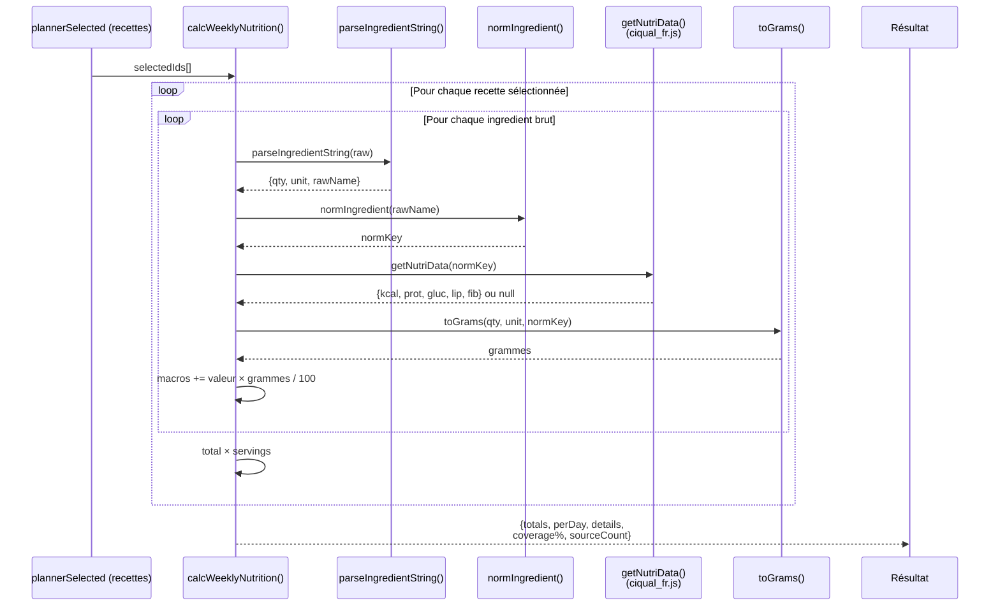
```mermaid
sequenceDiagram
    participant PLAN as plannerSelected (recettes)
    participant CALC as calcWeeklyNutrition()
    participant INGP as parseIngredientString()
    participant NORM as normIngredient()
    participant CQ as getNutriData()<br/>(ciqual_fr.js)
    participant TG as toGrams()
    participant RESULT as Résultat

    PLAN->>CALC: selectedIds[]
    loop Pour chaque recette sélectionnée
        loop Pour chaque ingredient brut
            CALC->>INGP: parseIngredientString(raw)
            INGP-->>CALC: {qty, unit, rawName}
            CALC->>NORM: normIngredient(rawName)
            NORM-->>CALC: normKey
            CALC->>CQ: getNutriData(normKey)
            CQ-->>CALC: {kcal, prot, gluc, lip, fib} ou null
            CALC->>TG: toGrams(qty, unit, normKey)
            TG-->>CALC: grammes
            CALC->>CALC: macros += valeur × grammes / 100
        end
        CALC->>CALC: total × servings
    end
    CALC-->>RESULT: {totals, perDay, details,<br/>coverage%, sourceCount}
```

### 5b. Stratégie de lookup CIQUAL (`getNutriData`)

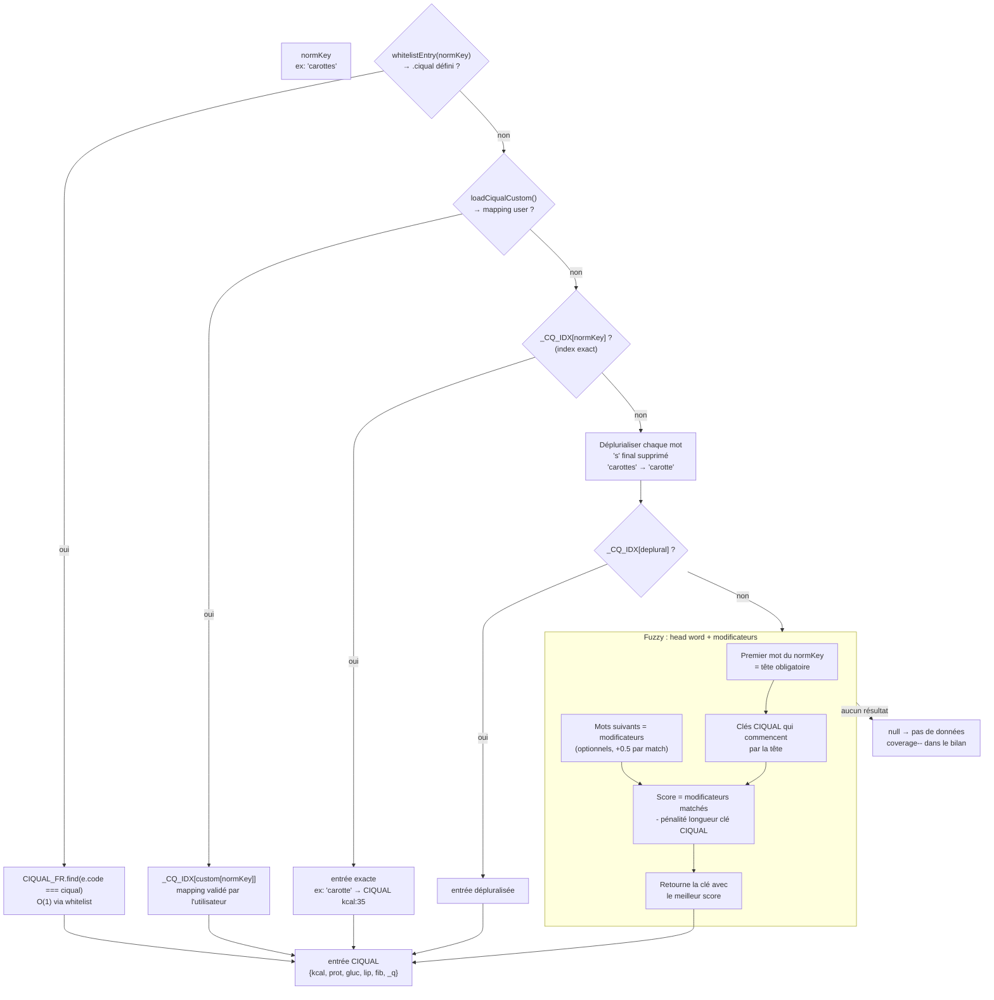
```mermaid
flowchart TD
    NK["normKey\nex: 'carottes'"]

    WL{"whitelistEntry(normKey)\n→ .ciqual défini ?"}
    WL -->|oui| WL1["CIQUAL_FR.find(e.code === ciqual)\nO(1) via whitelist"]
    WL -->|non| CM

    CM{"loadCiqualCustom()\n→ mapping user ?"}
    CM -->|oui| CM1["_CQ_IDX[custom[normKey]]\nmapping validé par l'utilisateur"]
    CM -->|non| EX

    EX{"_CQ_IDX[normKey] ?\n(index exact)"}
    EX -->|oui| EX1["entrée exacte\nex: 'carotte' → CIQUAL kcal:35"]
    EX -->|non| DEP

    DEP["Déplurialiser chaque mot\n's' final supprimé\n'carottes' → 'carotte'"]
    DEP2{"_CQ_IDX[deplural] ?"}
    DEP --> DEP2
    DEP2 -->|oui| DEP3["entrée dépluralisée"]
    DEP2 -->|non| FUZ

    subgraph FUZ["Fuzzy : head word + modificateurs"]
        F1["Premier mot du normKey\n= tête obligatoire"]
        F2["Mots suivants = modificateurs\n(optionnels, +0.5 par match)"]
        F3["Clés CIQUAL qui commencent\npar la tête"]
        F4["Score = modificateurs matchés\n- pénalité longueur clé CIQUAL"]
        F5["Retourne la clé avec\nle meilleur score"]
        F1 --> F3 --> F4 --> F5
        F2 --> F4
    end

    FOUND["entrée CIQUAL\n{kcal, prot, gluc, lip, fib, _q}"]
    MISS["null → pas de données\ncoverage-- dans le bilan"]

    WL1 & CM1 & EX1 & DEP3 & F5 --> FOUND
    FUZ -->|"aucun résultat"| MISS
```

### 5c. Structure CIQUAL (`data/ciqual_fr.js`)

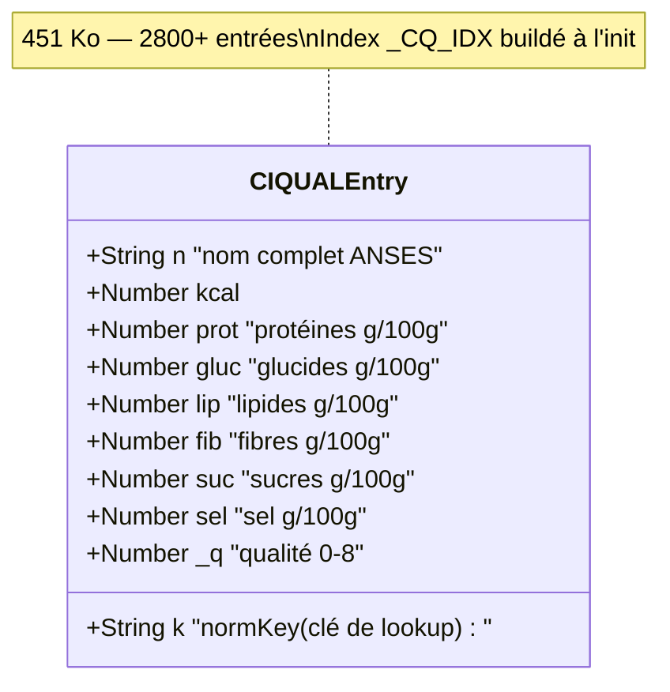
```mermaid
classDiagram
    class CIQUALEntry {
        +String k   "normKey (clé de lookup)"
        +String n   "nom complet ANSES"
        +Number kcal
        +Number prot "protéines g/100g"
        +Number gluc "glucides g/100g"
        +Number lip  "lipides g/100g"
        +Number fib  "fibres g/100g"
        +Number suc  "sucres g/100g"
        +Number sel  "sel g/100g"
        +Number _q   "qualité 0-8"
    }
    note for CIQUALEntry "451 Ko — 2800+ entrées\nIndex _CQ_IDX buildé à l'init"
```

---

## 6. Matching Colruyt

**Fichiers :** `js/bridge.js` → `js/colruyt.js`

### 6a. `bridgeLookup()` — traduction FR → termes NL

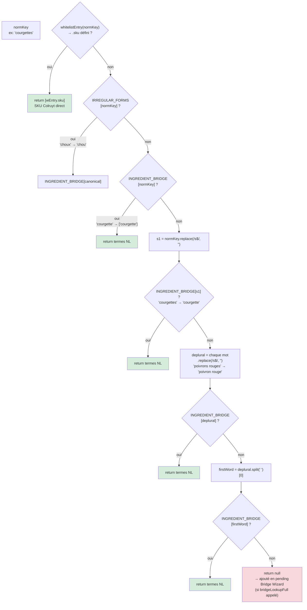
```mermaid
flowchart TD
    NK["normKey\nex: 'courgettes'"]

    WL{"whitelistEntry(normKey)\n→ .sku défini ?"}
    WL -->|oui| WL1["return [wEntry.sku]\nSKU Colruyt direct"]
    WL -->|non| IR

    IR{"IRREGULAR_FORMS\n[normKey] ?"}
    IR -->|"oui\n'choux' → 'chou'"| IR1["INGREDIENT_BRIDGE[canonical]"]
    IR -->|non| EX

    EX{"INGREDIENT_BRIDGE\n[normKey] ?"}
    EX -->|"oui\n'courgette' → ['courgette']"| EX1["return termes NL"]
    EX -->|non| S1

    S1["s1 = normKey.replace(/s$/, '')"]
    S1B{"INGREDIENT_BRIDGE[s1] ?\n'courgettes' → 'courgette'"}
    S1 --> S1B
    S1B -->|oui| S1R["return termes NL"]
    S1B -->|non| DEP

    DEP["deplural = chaque mot\n.replace(/s$/, '')\n'poivrons rouges' → 'poivron rouge'"]
    DEPB{"INGREDIENT_BRIDGE\n[deplural] ?"}
    DEP --> DEPB
    DEPB -->|oui| DEPR["return termes NL"]
    DEPB -->|non| FW

    FW["firstWord = deplural.split(' ')[0]"]
    FWB{"INGREDIENT_BRIDGE\n[firstWord] ?"}
    FW --> FWB
    FWB -->|oui| FWR["return termes NL"]
    FWB -->|non| NULL["return null\n→ ajouté en pending Bridge Wizard\n(si bridgeLookupFull appelé)"]

    style WL1 fill:#d4edda
    style EX1 fill:#d4edda
    style S1R fill:#d4edda
    style DEPR fill:#d4edda
    style FWR fill:#d4edda
    style NULL fill:#f8d7da
```

### 6b. `matchColruyt()` — recherche dans le catalogue NL

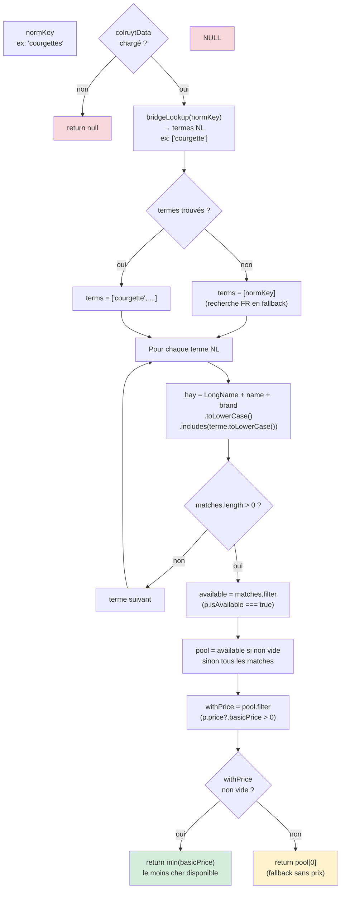
```mermaid
flowchart TD
    NK["normKey\nex: 'courgettes'"]

    LOADED{"colruytData\nchargé ?"}
    LOADED -->|non| NULLR["return null"]
    LOADED -->|oui| BL

    BL["bridgeLookup(normKey)\n→ termes NL\nex: ['courgette']"]
    BL2{"termes trouvés ?"}
    BL --> BL2
    BL2 -->|non| SELF["terms = [normKey]\n(recherche FR en fallback)"]
    BL2 -->|oui| TERMS

    TERMS["terms = ['courgette', ...]"]
    SELF --> LOOP

    LOOP["Pour chaque terme NL"]
    TERMS --> LOOP

    LOOP --> SUBSTR["hay = LongName + name + brand\n.toLowerCase()\n.includes(terme.toLowerCase())"]

    SUBSTR --> MATCH{"matches.length > 0 ?"}
    MATCH -->|non| NEXT["terme suivant"]
    NEXT --> LOOP
    MATCH -->|oui| AVAIL

    AVAIL["available = matches.filter\n(p.isAvailable === true)"]
    POOL["pool = available si non vide\nsinon tous les matches"]
    AVAIL --> POOL

    PRICE["withPrice = pool.filter\n(p.price?.basicPrice > 0)"]
    POOL --> PRICE

    CHEAP{"withPrice\nnon vide ?"}
    PRICE --> CHEAP
    CHEAP -->|oui| MIN["return min(basicPrice)\nle moins cher disponible"]
    CHEAP -->|non| FIRST["return pool[0]\n(fallback sans prix)"]

    style NULL fill:#f8d7da
    style NULLR fill:#f8d7da
    style MIN fill:#d4edda
    style FIRST fill:#fff3cd
```

### 6c. Chargement du catalogue (`fetchColruytLatest`)

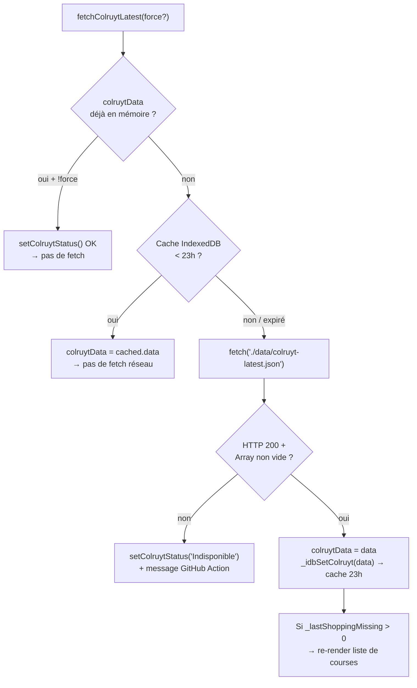
```mermaid
flowchart TD
    CALL["fetchColruytLatest(force?)"]

    ALREADY{"colruytData\ndéjà en mémoire ?"}
    CALL --> ALREADY
    ALREADY -->|"oui + !force"| STATUS["setColruytStatus() OK\n→ pas de fetch"]

    IDB{"Cache IndexedDB\n< 23h ?"}
    ALREADY -->|non| IDB
    IDB -->|oui| RESTORE["colruytData = cached.data\n→ pas de fetch réseau"]

    FETCH["fetch('./data/colruyt-latest.json')"]
    IDB -->|"non / expiré"| FETCH

    OK{"HTTP 200 +\nArray non vide ?"}
    FETCH --> OK
    OK -->|non| ERR["setColruytStatus('Indisponible')\n+ message GitHub Action"]
    OK -->|oui| STORE["colruytData = data\n_idbSetColruyt(data) → cache 23h"]

    RERENDER["Si _lastShoppingMissing > 0\n→ re-render liste de courses"]
    STORE --> RERENDER
```

> **Catalogue vide :** si `data/colruyt-latest.json` est `[]`, déclencher manuellement l'Action GitHub **"Mirror Colruyt catalog"** (onglet Actions du repo). L'action remonte jusqu'à 7 jours en arrière dans le bucket GCS `colruyt-products`.

---

## 7. Faisabilité des recettes

**Fichier :** `js/app.js` — `checkFeasibility(recipe)`

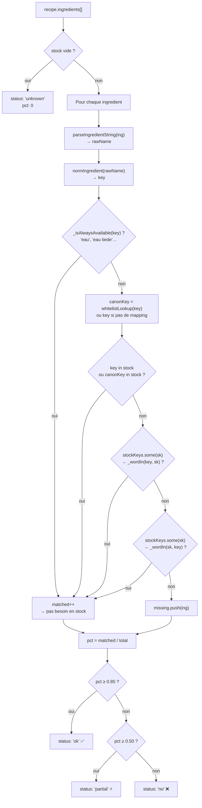
```mermaid
flowchart TD
    REC["recipe.ingredients[]"]
    EMPTY{"stock vide ?"}
    REC --> EMPTY
    EMPTY -->|oui| UNK["status: 'unknown'\npct: 0"]
    EMPTY -->|non| LOOP

    LOOP["Pour chaque ingredient"]

    PARSE["parseIngredientString(ing)\n→ rawName"]
    LOOP --> PARSE
    PARSE --> NORM["normIngredient(rawName)\n→ key"]

    ALWAYS{"_isAlwaysAvailable(key) ?\n'eau', 'eau tiede'…"}
    NORM --> ALWAYS
    ALWAYS -->|oui| MATCH_OK["matched++\n→ pas besoin en stock"]
    ALWAYS -->|non| WL

    WL["canonKey = whitelistLookup(key)\nou key si pas de mapping"]
    WL --> EX

    EX{"key in stock\nou canonKey in stock ?"}
    EX -->|oui| MATCH_OK
    EX -->|non| FUZ1

    FUZ1{"stockKeys.some(sk)\n→ _wordIn(key, sk) ?"}
    FUZ1 -->|oui| MATCH_OK
    FUZ1 -->|non| FUZ2

    FUZ2{"stockKeys.some(sk)\n→ _wordIn(sk, key) ?"}
    FUZ2 -->|oui| MATCH_OK
    FUZ2 -->|non| MISS["missing.push(ing)"]

    PCT["pct = matched / total"]
    MATCH_OK --> PCT
    MISS --> PCT

    STATUS{"pct ≥ 0.85 ?"}
    PCT --> STATUS
    STATUS -->|oui| OK["status: 'ok' ✅"]
    STATUS -->|non| HALF

    HALF{"pct ≥ 0.50 ?"}
    HALF -->|oui| PART["status: 'partial' ⚡"]
    HALF -->|non| NO["status: 'no' ❌"]
```

> **`_wordIn(haystack, needle)`** : teste la présence de `needle` comme mot entier dans `haystack` (regex `(?:^| )needle(?= |$)`) — évite que "lait" matche "travail".

---

## 8. Liste de courses complète

**Fichier :** `js/planner.js` — `generateShoppingList()`

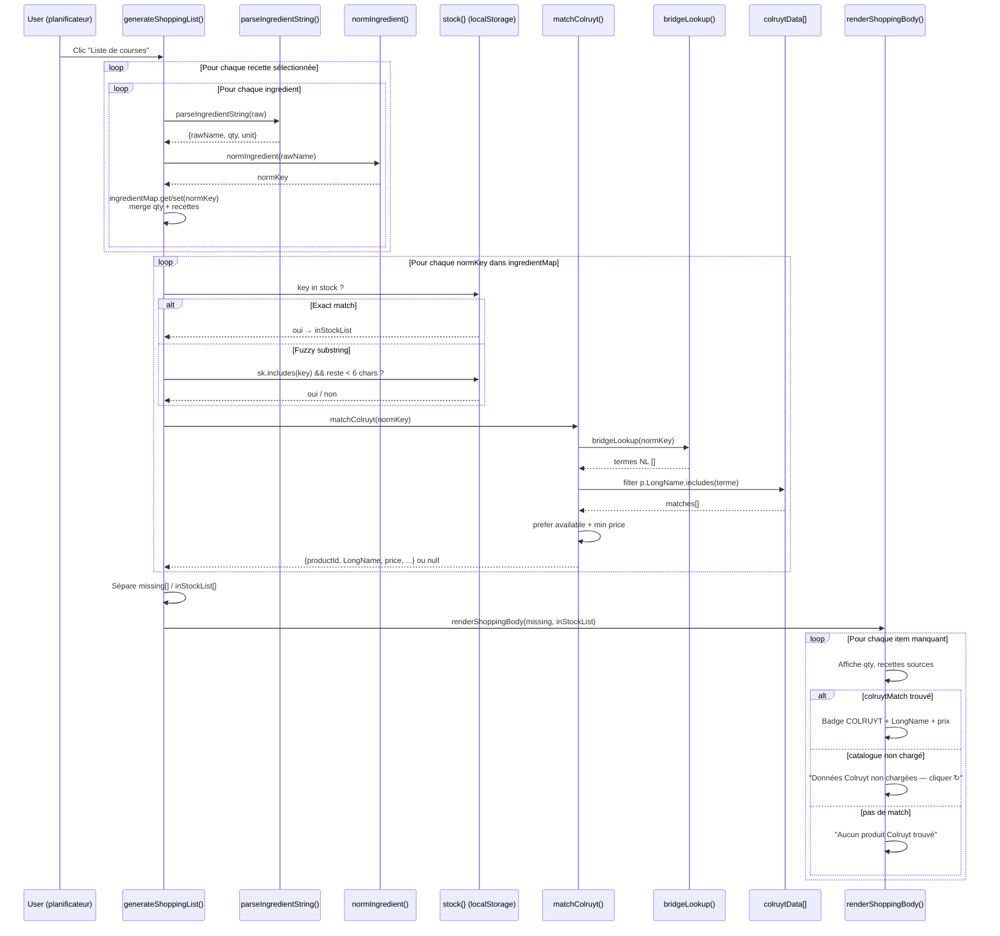
```mermaid
sequenceDiagram
    participant USER as User (planificateur)
    participant PLAN as generateShoppingList()
    participant INGP as parseIngredientString()
    participant NORM as normIngredient()
    participant STOCK as stock{} (localStorage)
    participant COL as matchColruyt()
    participant BRIDGE as bridgeLookup()
    participant DATA as colruytData[]
    participant RENDER as renderShoppingBody()

    USER->>PLAN: Clic "Liste de courses"

    loop Pour chaque recette sélectionnée
        loop Pour chaque ingredient
            PLAN->>INGP: parseIngredientString(raw)
            INGP-->>PLAN: {rawName, qty, unit}
            PLAN->>NORM: normIngredient(rawName)
            NORM-->>PLAN: normKey
            PLAN->>PLAN: ingredientMap.get/set(normKey)<br/>merge qty + recettes
        end
    end

    loop Pour chaque normKey dans ingredientMap
        PLAN->>STOCK: key in stock ?
        alt Exact match
            STOCK-->>PLAN: oui → inStockList
        else Fuzzy substring
            PLAN->>STOCK: sk.includes(key) && reste < 6 chars ?
            STOCK-->>PLAN: oui / non
        end

        PLAN->>COL: matchColruyt(normKey)
        COL->>BRIDGE: bridgeLookup(normKey)
        BRIDGE-->>COL: termes NL []
        COL->>DATA: filter p.LongName.includes(terme)
        DATA-->>COL: matches[]
        COL->>COL: prefer available + min price
        COL-->>PLAN: {productId, LongName, price, ...} ou null
    end

    PLAN->>PLAN: Sépare missing[] / inStockList[]
    PLAN->>RENDER: renderShoppingBody(missing, inStockList)

    loop Pour chaque item manquant
        RENDER->>RENDER: Affiche qty, recettes sources
        alt colruytMatch trouvé
            RENDER->>RENDER: Badge COLRUYT + LongName + prix
        else catalogue non chargé
            RENDER->>RENDER: "Données Colruyt non chargées — cliquer ↻"
        else pas de match
            RENDER->>RENDER: "Aucun produit Colruyt trouvé"
        end
    end
```

---

## 9. Structures de données

### Stock (localStorage `recettes_stock`)

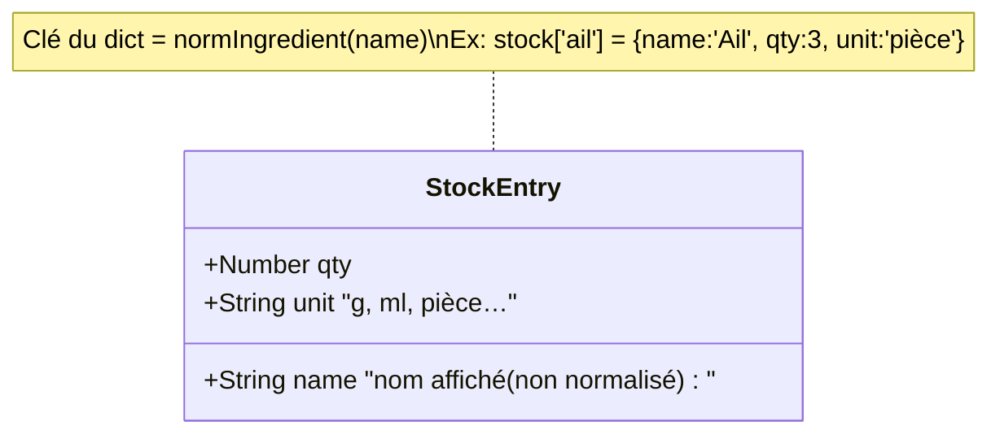
```mermaid
classDiagram
    class StockEntry {
        +String name    "nom affiché (non normalisé)"
        +Number qty
        +String unit    "g, ml, pièce…"
    }
    note for StockEntry "Clé du dict = normIngredient(name)\nEx: stock['ail'] = {name:'Ail', qty:3, unit:'pièce'}"
```

### Recette (RECIPES array + localStorage `recettes_custom`)

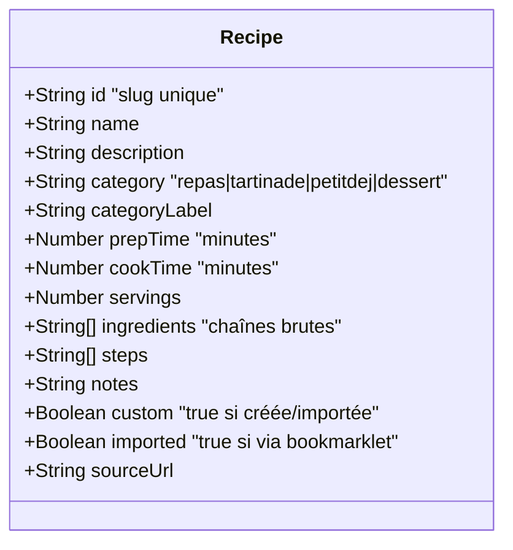
```mermaid
classDiagram
    class Recipe {
        +String id          "slug unique"
        +String name
        +String description
        +String category    "repas|tartinade|petitdej|dessert"
        +String categoryLabel
        +Number prepTime    "minutes"
        +Number cookTime    "minutes"
        +Number servings
        +String[] ingredients "chaînes brutes"
        +String[] steps
        +String notes
        +Boolean custom     "true si créée/importée"
        +Boolean imported   "true si via bookmarklet"
        +String sourceUrl
    }
```

### Catalogue Colruyt (IndexedDB `cuisinotron` → cache)

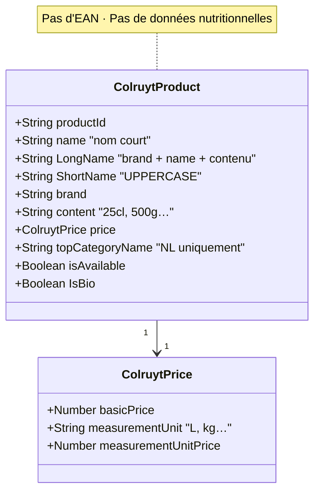
```mermaid
classDiagram
    class ColruytProduct {
        +String productId
        +String name        "nom court"
        +String LongName    "brand + name + contenu"
        +String ShortName   "UPPERCASE"
        +String brand
        +String content     "25cl, 500g…"
        +ColruytPrice price
        +String topCategoryName "NL uniquement"
        +Boolean isAvailable
        +Boolean IsBio
    }
    class ColruytPrice {
        +Number basicPrice
        +String measurementUnit "L, kg…"
        +Number measurementUnitPrice
    }
    ColruytProduct "1" --> "1" ColruytPrice
    note for ColruytProduct "Pas d'EAN · Pas de données nutritionnelles"
```

### Bridge FR → NL (`js/bridge.js`)

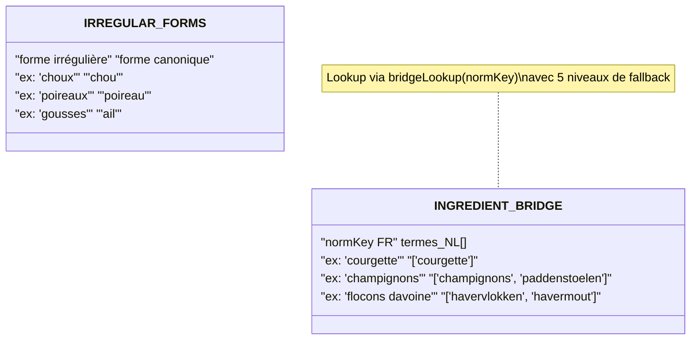
```mermaid
classDiagram
    class INGREDIENT_BRIDGE {
        "normKey FR" termes_NL[]
        "ex: 'courgette'" "['courgette']"
        "ex: 'champignons'" "['champignons', 'paddenstoelen']"
        "ex: 'flocons davoine'" "['havervlokken', 'havermout']"
    }
    class IRREGULAR_FORMS {
        "forme irrégulière" "forme canonique"
        "ex: 'choux'" "'chou'"
        "ex: 'poireaux'" "'poireau'"
        "ex: 'gousses'" "'ail'"
    }
    note for INGREDIENT_BRIDGE "Lookup via bridgeLookup(normKey)\navec 5 niveaux de fallback"
```

---

## Récapitulatif des fonctions clés

| Fonction | Fichier | Entrée | Sortie |
|---|---|---|---|
| `parseIngredientString(str)` | `ingredientParser.js` | `"200g d'ail"` | `{qty:200, unit:'g', rawName:'ail'}` |
| `cleanIngredientName(raw)` | `ingredientParser.js` | `"ail haché"` | `"ail"` |
| `normIngredient(str)` | `utils.js` | `"Ail haché"` | `"ail hache"` |
| `canonicalize(parsed)` | `utils.js` | `{name:'noix de beurre', qty:1}` | `{name:'beurre', qty:'10', unit:'g'}` |
| `bridgeLookup(normKey)` | `bridge.js` | `"courgettes"` | `['courgette']` |
| `bridgeLookupFull(normKey)` | `bridgeWizard.js` | `"courgettes"` | `['courgette']` + pending si null |
| `matchColruyt(normKey)` | `colruyt.js` | `"courgette"` | `ColruytProduct` ou null |
| `getNutriData(normKey)` | `ciqual_fr.js` | `"carotte"` | `{kcal:35, prot:0.8, ...}` |
| `getNutritionFor(normKey)` | `nutrition.js` | `"carotte"` | `{kcal:35, p:0.8, source:'ciqual'}` |
| `checkFeasibility(recipe)` | `app.js` | `Recipe` | `{status:'ok', pct:0.9, missing:[]}` |
| `generateShoppingList()` | `planner.js` | — | render + `_lastShoppingMissing[]` |
| `handleBillImage(file)` | `billScanner.js` | Image | items[] → stock |
| `parseRecipeJsonLd(ld)` | `importer.js` | JSON-LD object | `{title, ingredients[], steps[], ...}` |
